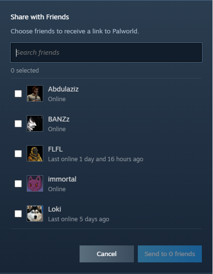

# Steam Share

Steam Share is a Millennium plugin that adds a native **Share** button to Steam Store game pages.

With a single click, you can open a friend picker, select one or multiple Steam friends, and send the current game's Steam Store link directly to them without leaving the page.

## Features

- Native Share button integrated into Steam Store game pages.
- Matches Steam's built-in interface and styling.
- Select one or multiple friends.
- Send the current game's Steam Store link with a single action.
- Automatically works while browsing different game pages.
- Lightweight and designed for Millennium.

## Installation

1. Install Millennium.
2. Download or clone this repository.
3. Build the plugin:

```bash
bun install
bun run build
```

4. Place the plugin inside your Millennium plugins directory.
5. Enable **Steam Share** from Millennium and restart Steam.

## Usage

1. Open any Steam Store game page.
2. Click the **Share** button.
3. Select one or more friends.
4. Click **Send**.

The selected friends will receive the current game's Steam Store link.

## Screenshots

### Share button


### Friend picker



## License

MIT License
