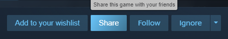
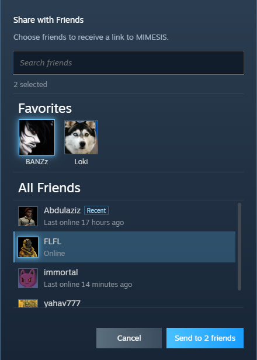

# Steam Share

Steam Share adds a **Share** button to game pages in the Steam Store. Click it, choose one or more friends, and send them the game's Store link without leaving Steam.

The button sits next to Steam's **Wishlist**, **Follow**, and **Ignore** buttons and uses the same styling, so it feels at home on the page.

## What it looks like

### Share button



### Friend picker



## How to use it

1. Open a game's Store page in the Steam desktop client.
2. Click **Share**.
3. Pick the friends you want to send the game to.
4. Click **Send**.

## Friend picker

- Keep the people you share with most in **Favorites**.
- Drag friends in or out of Favorites to update the list.
- Recently contacted friends are marked with a small **Recent** badge.
- Search your full friends list.
- Select any mix of favorites and other friends before sending.

The game link is also copied to your clipboard as a fallback.

## What's new in v1.1.0

- A Favorites section for the friends you contact most.
- A Recent badge for the last person you shared with.
- Drag-and-drop favorite management.
- Friend cards that can be selected directly, without checkboxes.

## Building from source

```powershell
bun install
bun run build
```

Restart Steam after building so Millennium can load the new files.
